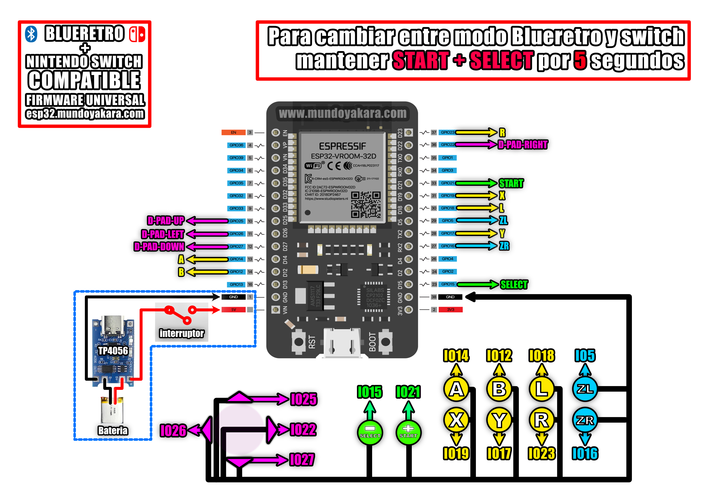

volver al [INICIO ](index.md).

#### un poco de historia?
control tipo NINTENDO 64 para nuestras [BLUERETRO](https://github.com/darthcloud/BlueRetro) y tambien con compatibilidad absoluta para **nintendo switch**

y esto nos permitira crear a futuro todo tipo de controles, convirttiendo directamente nuestros controles clasicos cde cable en unos inalambricos bluetooth, asi que dejen volar su imaginacion mientras hacemos nuestro primer proyecto.

### WIRELESS 64 control generico **"NINTENDO 64** 
Para grabar tu firmware para **"COMPATIBILIDAD BLUERETRO"**, asegurate de conectar tu ESP32 via USB y presiona el siguiente boton. recuerda usar **CHROME** para ver este boton

<esp-web-install-button manifest="firmware/firmware_build/642/manifest.json"></esp-web-install-button>

los diagramas en alta definicion puedes descargarlos [desde este enlace](https://www.mundoyakara.com/2022/07/hacer-control-arcade-bluetooth.html)

