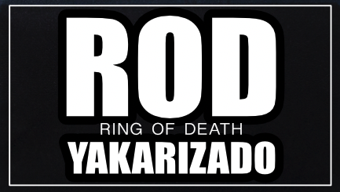
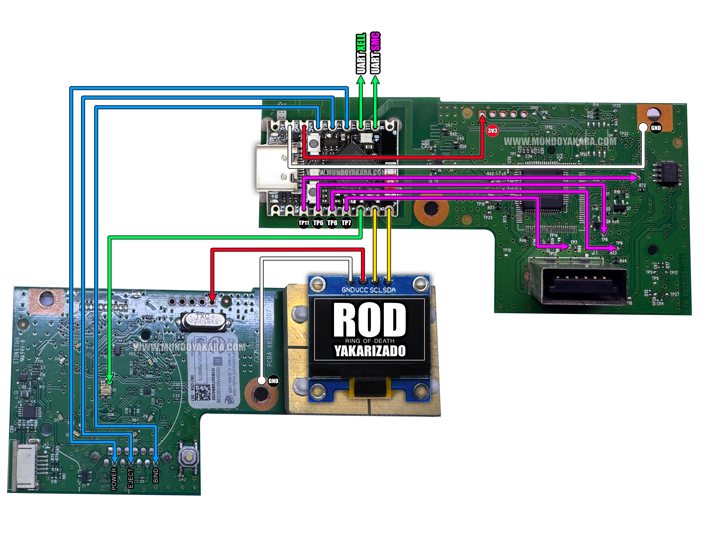

###  **"firmware ROD (Ring of Death) YAKARIZADO"**  [ESP32-S3 super mini] **"ver 0.5"**

<esp-web-install-button manifest="firmware/firmware_build/ROD-YAKARIZADO/manifest.json"></esp-web-install-button>

###  **"DIAGRAMA DE INSTALACION"** estara disponible en tu panel del curso
  

DISPONIBLE EN TU PAGINA DEL CURSO [CLIC AQUI PARA VER EL DIAGRAMA](https://cursos-yakara.odoo.com/slides/slide/diagrama-18?fullscreen=1) no olvides verlo .

