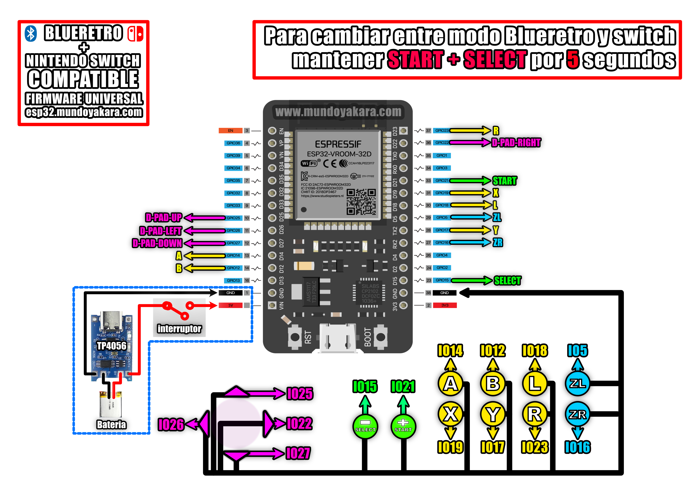

volver al [INICIO ](index.md).

#### un poco de historia?
primer control tipo arcade para nuestras [BLUERETRO](https://github.com/darthcloud/BlueRetro) y tambien con compatibilidad absoluta para **nintendo switch**

y esto nos permitira crear a futuro todo tipo de controles, convirttiendo directamente nuestros controles clasicos cde cable en unos inalambricos bluetooth, asi que dejen volar su imaginacion mientras hacemos nuestro primer proyecto.

### arcade esp32 para **"BLUERETRO"** 
Para grabar tu firmware para **"COMPATIBILIDAD BLUERETRO"**, asegurate de conectar tu ESP32 via USB y presiona el siguiente boton. recuerda usar **CHROME** para ver este boton

<esp-web-install-button manifest="firmware/firmware_build/arcade-blueretro/manifest.json"></esp-web-install-button>

### informacion del firmware **"BLUERETRO"**
recuerda que el control de arcade **compatible con blueretro** funciona como un **teclado bluetooth** y que gracias a la [compatibilidad nativa con teclado bluetooth](https://www.youtube.com/watch?v=Y1S4s3QiVUM&t=192sen) en las opciones de **blueretro** he creado este proyecto unicamente comprendiendo la libreria de [ESP32 BLE Keyboard library](https://github.com/T-vK/ESP32-BLE-Keyboard) asi que es totalmente compatible con **windows, mac, android, raspberry, tv box, android tv, etc**. y tu mismo puedes mapear los botones a usar segun el dispositivo al que lo conectes, el mapeo de botones y su asignacion se encuentran disponibles en el diagrama al final de la pagina, que puedes descargar en alta resolucion desde [este enlace](https://www.mundoyakara.com/2022/07/hacer-control-arcade-bluetooth.html) por defecto en tus consolas blueretro, todos los botones se mapearan automaticamente, menoz zl y zr estos debes asignarlos tu segun la consola o funcion, por ejemplo habilitarlos en ps2 como L2 Y R2 todo esto se hace desde la pagina de [BLUERETRO.io](https://blueretro.io/)

### arcade esp32 para **"NINTENDO SWITCH"** 
Para grabar tu firmware para **"COMPATIBILIDAD CON NINTENDO SWITCH"**, asegurate de conectar tu ESP32 via USB y presiona el siguiente boton. recuerda usar **CHROME** para ver este boton

<esp-web-install-button manifest="firmware/firmware_build/arcade-switch/manifest.json"></esp-web-install-button>
### informacion del firmware **"esp32 para NINTENDO SWICTH"**
Basado en una **Release no oficial** modificada y remapeada en su totalidad por mi del [ESP-IDF RetroBlue Bluetooth Gamepad AP](https://github.com/mitchellcairns/RetroBlue-ESP32) proyecto original de [mitchellcairns](https://github.com/mitchellcairns) que nos permite utilizar nuestro **esp32 como un control de nintendo switch**, que no hace uso de NIMBLE y por ese motivo aun no es compatible con blueretro pero si con **nintendo swicth normal, nintendo switch lite y nintendo switch oled**,
los botones y sus mapeos **son exactamente los mismos del diagrama**

  
#### tienes dudas de como HACER ESTE PROYECTO?

Este proyecto viene acompañado de un [video tutorial completo](https://youtu.be/NLdcXWorapA) no olvides verlo .

### NO TE FUNCIONA? 
No creas que algo salio mal ni pierdas tiempo reprogramando o cambiando tus soldaduras, incluso a mi en las 1001 prubeas me sucedio y es tan facil de solucionar como seguir el video de [Actualizar BLUERETRO](https://youtu.be/wpAVl-TC-Xg) de tu consola, para **implementar la compatibilidad con teclado bluetooth** que usa este proyecto

### DIAGRAMAS UNIVERSAL PARA BLUERETRO Y NINTENDO SWICTH, solo cambia el firmware que le instalas

los diagramas en alta definicion puedes descargarlos [desde este enlace](https://www.mundoyakara.com/2022/07/hacer-control-arcade-bluetooth.html)

