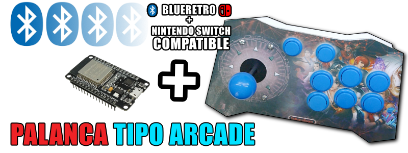

volver al [INICIO ](index.md).

### arcade esp32 para **"BLUERETRO"** 
Para grabar tu firmware para **"COMPATIBILIDAD BLUERETRO"**, asegurate de conectar tu ESP32 via USB y presiona el siguiente boton.

<esp-web-install-button manifest="firmware/firmware_build/arcade-blueretro/manifest.json"></esp-web-install-button>

  
#### tienes dudas de como usar este tipo de programacion?

para entender el uso de esta pagina debes seguir [este tutorial](https://www.youtube.com) .

