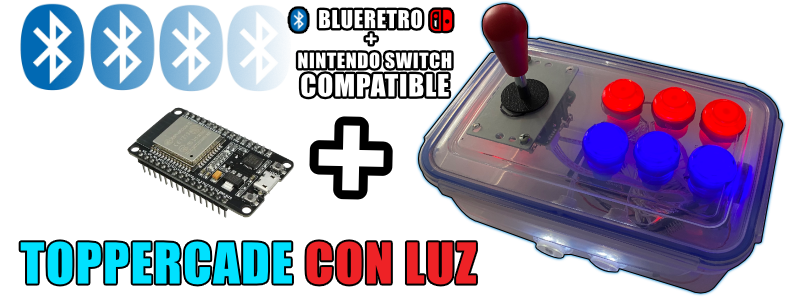
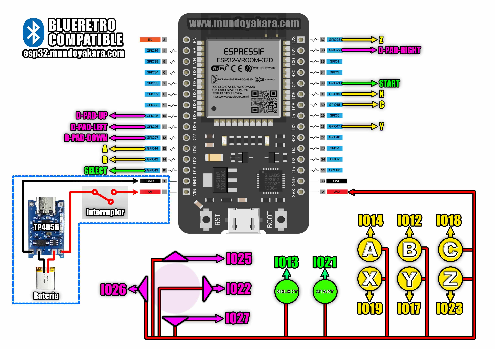

volver al [INICIO ](index.md).

#### un poco de historia?
Basado en una **Release no oficial** del [HOJA-LIB-ESP32](https://github.com/HandHeldLegend/HOJA-LIB-ESP32) proyecto original de [mitchellcairns](https://github.com/mitchellcairns) que nos permite utilizar nuestro **esp32 como un control de nintendo switch**, 

ademas de una nueva implementacion de doble fimrware gracias a **JPZV** en esta proyecto de ARCADE **usaremos una version modificada** del [Blu N64](https://github.com/JPZV/BluN64-ESP32) que ha evolucionado hasta convertirse muy pronto en la solucion definitiva para crear todo tipo de controles bluetooth, convirtiendo directamente nuestros controles clasicos de cable en unos inalambricos asi que dejen volar su imaginacion mientras hacemos un control tipo **ARCADE**

Para cambiar entre payload de **BLUERETRO** y payload compatible con **NINTENDO SWITCH** Solo hay que mantener presionado **SELECT + START** durante **5 segundos**

y esto nos permitira crear todo tipo de controles y tambien hacer nuestra propias palancas tipo arcade
y lo mejor, 

### totalmente compatible con 

-windows
-linux
-android
-tv box
-pandora
-blueretro
-steam deck
-nintendo switch normal
-nintendo switch lite
-nintendo switch oled

ESTE FIRMWARE ESTA CREADO PARA USAR CON LOS KIT DE ARCADE QUE INCLUYEN ILUMINACION LED, si tu kit es de boton normal, debes usar la pagina normal de arcade que encontraras al [INICIO ](index.md)

### ARCADE "CON LUZ" UNIVERSAL JPZV FIRMWARE **"NINTENDO SWITCH + BLUERETRO"** 

Para grabar tu firmware para **"GAMEPAD TIPO ARCADE CON COMPATIBILIDAD CON NINTENDO SWITCH Y ADEMAS CON BLUERETRO"**, asegurate de conectar tu ESP32 via USB y presiona el siguiente boton. recuerda usar **CHROME** para ver este boton

<esp-web-install-button manifest="firmware/firmware_build/ARCADE-LUZ-UNIVERSAL-JPZV/manifest.json"></esp-web-install-button>

  
#### tienes dudas de como HACER ESTE PROYECTO?

Este proyecto viene acompañado de un [video tutorial completo](https://youtu.be/5mQKpUOdqcE) no olvides verlo .

### DIAGRAMAS UNIVERSAL PARA BLUERETRO Y NINTENDO SWICTH, solo cambia el firmware que le instalas

los diagramas en alta definicion puedes descargarlos [desde este enlace](https://www.mundoyakara.com/2023/03/convierte-un-topper-en-una-palanca.html)