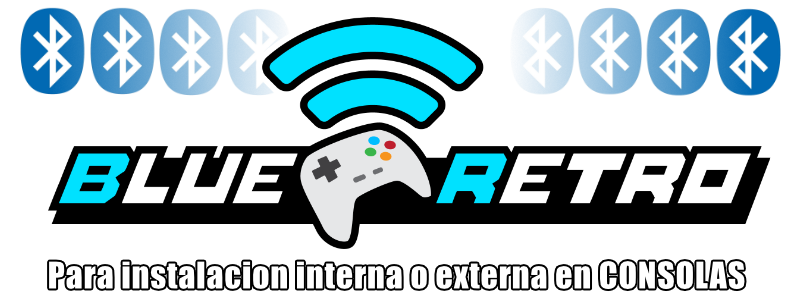

volver al [INICIO ](index.md).

#### un poco de historia?
El proyecto [BLUERETRO](https://github.com/darthcloud/BlueRetro) nos permite instalar de manera tanto interna como externa un modulo ESP32 para poder usar controles bluetooth en nuestras consolas clasicas

he creado esta seccion para simplificar la programacion del modulo ademas[les he creado un video para actualizar ](https://youtu.be/wpAVl-TC-Xg)cualquier instalacion de blueretro a la mas reciente

en esta pagina podras instalar la version [1.8.3](https://github.com/darthcloud/BlueRetro/releases/tag/v1.8.3) 
**NECESARIA PARA USAR EL CONTROL N64 BLUETOOTH** [que aprendimos a crear aqui:](n64.md)

la cual es totalmente funcional con todos los proyectos de instalacion de blueretro de mi canal pero si quieres siempre estar con la version mas reciente del software te recomiendo [realizar este video tutorial ](https://youtu.be/wpAVl-TC-Xg) para actualizar de manera inalambrica y sin necesidad de cable usb, tu instalacion de **BLUERETRO** sin necesidad de conectarlo fisicamente al pc

recuerda que ahora la pagina para [descargar los archivos de blueretro es: ](https://darthcloud.itch.io/blueretro) siempre es recomendable actualizar tu blueretro

###  **"BLUERETRO"** para PSX, PS1, PS2

<esp-web-install-button manifest="firmware/firmware_build/blueretro/psx/manifest.json"></esp-web-install-button>

###  **"BLUERETRO"** para NES

<esp-web-install-button manifest="firmware/firmware_build/blueretro/nes/manifest.json"></esp-web-install-button>

###  **"BLUERETRO"** para SUPER NINTENDO

<esp-web-install-button manifest="firmware/firmware_build/blueretro/snes/manifest.json"></esp-web-install-button>

###  **"BLUERETRO"** para Nintendo 64

<esp-web-install-button manifest="firmware/firmware_build/blueretro/n64/manifest.json"></esp-web-install-button>

###  **"BLUERETRO"** para GAMECUBE

<esp-web-install-button manifest="firmware/firmware_build/blueretro/gamecube/manifest.json"></esp-web-install-button>

###  **"BLUERETRO"** para DREAMCAST

<esp-web-install-button manifest="firmware/firmware_build/blueretro/dreamcast/manifest.json"></esp-web-install-button>

###  **"BLUERETRO"** para SEGA GENESIS MEGADRIVE

<esp-web-install-button manifest="firmware/firmware_build/blueretro/genesis/manifest.json"></esp-web-install-button>

###  **"BLUERETRO"** para SEGA SATURN

<esp-web-install-button manifest="firmware/firmware_build/blueretro/saturn/manifest.json"></esp-web-install-button>

###  **"BLUERETRO"** para WII-EXT "GAMEBOY DMG"

<esp-web-install-button manifest="firmware/firmware_build/blueretro/dmg/manifest.json"></esp-web-install-button>

#### no estan todas las consolas?
he listado unicamente los firmware para los proyectos que he documentado en mi canal, pero tal como lo he mostrado [en este video tutorial ](https://youtu.be/wpAVl-TC-Xg) podras actualizar **CUALQUIER** Firmware actual de **BLUERETRO** y tu mismo podras el firmware que necesites

