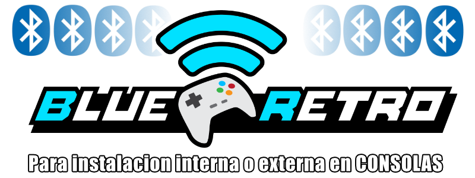

volver al [INICIO ](index.md).

###  **"BLUERETRO"** para DMG

<esp-web-install-button manifest="firmware/firmware_build/blueretro/dmg/manifest.json"></esp-web-install-button>

#### no estan todas las consolas?
he listado unicamente los firmware para los proyectos que he documentado en mi canal, pero tal como lo he mostrado [en este video tutorial ](https://youtu.be/wpAVl-TC-Xg) podras actualizar **CUALQUIER** Firmware actual de **BLUERETRO** y tu mismo podras el firmware que necesites

