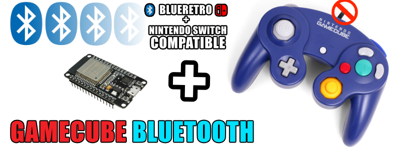

volver al [INICIO ](index.md).

#### un poco de historia?
Basado en una **Release no oficial** del [HOJA-LIB-ESP32](https://github.com/HandHeldLegend/HOJA-LIB-ESP32) proyecto original de [mitchellcairns](https://github.com/mitchellcairns) que nos permite utilizar nuestro **esp32 como un control de nintendo switch**, 

ademas de una nueva implementacion de doble fimrware gracias a **JPZV** en esta proyecto de GAMECUBE **usaremos una version modificada** del [Blu N64](https://github.com/JPZV/BluN64-ESP32) que ha evolucionado hasta convertirse muy pronto en la solucion definitiva para crear todo tipo de controles bluetooth, convirtiendo directamente nuestros controles clasicos de cable en unos inalambricos asi que dejen volar su imaginacion mientras hacemos un control tipo GAMECUBE

Para cambiar entre payload de **BLUERETRO** y payload compatible con **NINTENDO SWITCH** Solo hay que mantener presionado **Z + START** durante **10 segundos**

### totalmente compatible con 

-windows
-linux
-android
-tv box
-pandora
-blueretro
-steam deck
-nintendo switch normal
-nintendo switch lite
-nintendo switch oled

si queremos usar nuestro control bluetooth de gamecube en una consola gamecube con blueretro es totalmente **OBLIGATORIO** tener instalada la version **1.8.2 (o superior)** de blueretro [COMO LO VIMOS EN ESTE TUTORIAL](https://youtu.be/wpAVl-TC-Xg) de manera inalambrica sin conectar el esp32 a nuestro pc, o si podemos conectar podremos hacer una instalacion via usb [desde este enlace](blueretro.md)

### JPZV V1.1 para **"NINTENDO GAMECUBE** 
Para grabar tu firmware **"UNIVERSAL GAMECUBE JPVZ"**, asegurate de conectar tu ESP32 via USB y presiona el siguiente boton. recuerda usar **CHROME** para ver este boton

<esp-web-install-button manifest="firmware/firmware_build/GAMECUBE-UNIVERSAL-JPZV/manifest.json"></esp-web-install-button>

Para cambiar entre payload de **BLUERETRO** y payload compatible con **NINTENDO SWITCH** Solo hay que mantener presionado **Z + START** durante **10 segundos**

#### tienes dudas de como HACER ESTE PROYECTO?

Este proyecto viene acompañado de un [video tutorial completo](https://youtu.be/I-eD3m9FG4s) no olvides verlo .

los diagramas en alta definicion puedes descargarlos [desde este enlace](https://blogger.googleusercontent.com/img/b/R29vZ2xl/AVvXsEjKylCOfEuCNMamdnB_tEQCsjf1jxalkQ7Y7vUdWpUHzg_h8GbciP72zUyhO5UqCu-336UaOYc5vPYnHX4Kyl4IcjgienQZAh-y_xufkhG90SNSKUhcBbfjDZL7jyoJogpKO-0vm-V6_zorG3iA_oC5oxr1mVyiLdpr0iYY3bh_tJh6ChR6Po_zoiZNqQ/s3508/GAMECUBE%20UNIVERSAL.png)

