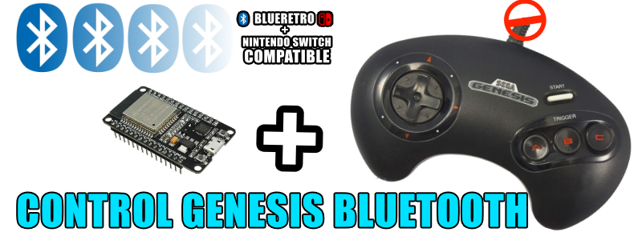
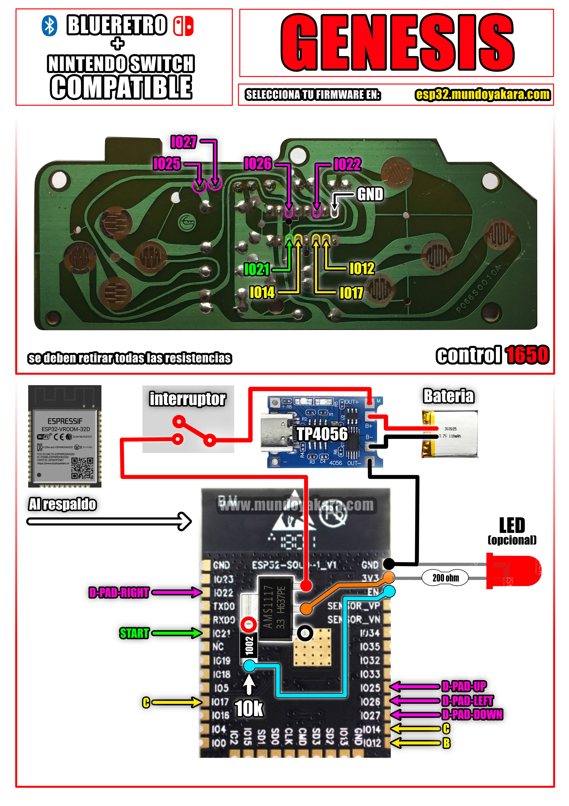

volver al [INICIO ](index.md).

### genesis / megadrive ONLINE esp32 DIY para **"NINTENDO SWITCH"** 

Para grabar tu firmware para **"GAMEPAD TIPO genesis / megadrive  CON COMPATIBILIDAD CON NINTENDO SWITCH"**, asegurate de conectar tu ESP32 via USB y presiona el siguiente boton. recuerda usar **CHROME** para ver este boton

<esp-web-install-button manifest="firmware/firmware_build/genesis-switch/manifest.json"></esp-web-install-button>

### informacion del firmware **"CONTROL genesis / megadrive  ONLINE esp32 DIY"**
Basado en una **Release no oficial** modificada y remapeada en su totalidad por mi del [ESP-IDF RetroBlue Bluetooth Gamepad AP](https://github.com/mitchellcairns/RetroBlue-ESP32) proyecto original de [mitchellcairns](https://github.com/mitchellcairns) que nos permite utilizar nuestro **esp32 como un control genesis / megadrive  de nintendo switch**, que no hace uso de NIMBLE y por ese motivo aun no es compatible con blueretro, pero si con **nintendo swicth normal, nintendo switch lite y nintendo switch oled**,
los botones y sus mapeos **son exactamente los mismos del diagrama**
adicionalmente se agrego la funcion de botones combo para evitar solar botones adicionales gracias a
[@eolvera85](https://twitter.com/eolvera85) idea implementada inicialmente por [XGAMES VIDEOJUEGOS](https://www.youtube.com/c/XGAMESVIDEOJUEGOS) quienes amablemente compartieron su implementacion conmigo.

### genesis / megadrive BLUETOOTH esp32 DIY para **"BLUERETRO"** 

Para grabar tu firmware para **"GAMEPAD TIPO genesis / megadrive  CON COMPATIBILIDAD CON BLUERETRO"**, asegurate de conectar tu ESP32 via USB y presiona el siguiente boton. recuerda usar **CHROME** para ver este boton

<esp-web-install-button manifest="firmware/firmware_build/arcade-blueretro/manifest.json"></esp-web-install-button>

### informacion del firmware **"BLUERETRO"**
recuerda que el control de arcade **compatible con blueretro** funciona como un **teclado bluetooth** y que gracias a la [compatibilidad nativa con teclado bluetooth](https://www.youtube.com/watch?v=Y1S4s3QiVUM&t=192sen) en las opciones de **blueretro** he creado este proyecto unicamente comprendiendo la libreria de [ESP32 BLE Keyboard library](https://github.com/T-vK/ESP32-BLE-Keyboard) asi que es totalmente compatible con **ios, windows, mac, android, raspberry, tv box, android tv, etc**. y tu mismo puedes mapear los botones a usar segun el dispositivo al que lo conectes, el mapeo de botones y su asignacion se encuentran disponibles en el diagrama al final de la pagina, que puedes descargar en alta resolucion desde [este enlace](https://www.mundoyakara.com/2022/07/hacer-control-arcade-bluetooth.html) por defecto en tus consolas blueretro, todos los botones se mapearan automaticamente, de igual manera tu puedes mapear manualmente los botones en la pagina de [BLUERETRO.io](https://blueretro.io/)

#### tienes dudas de como HACER ESTE PROJECTO?

Este proyecto viene acompañado de un [video tutorial completo](https://youtu.be/o03lGDEhEgg) no olvides verlo .

### DIAGRAMA UNIVERSAL PARA EL CONTROL genesis / megadrive ONLINE esp32 DIY lite version"

los diagramas en alta definicion puedes descargarlos [desde este enlace](https://www.mundoyakara.com/2022/10/converita-control-bluetooth-sega.html)

