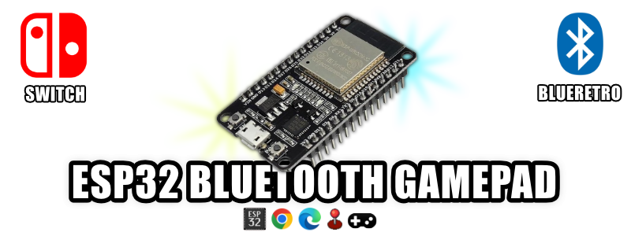

#### de que trata?

El ESP32 es un dispositivo que nos facilita la implementacion de distintos tipos de proyectos y su programacion normalmente requiere de software y programas adicionales para grabar diferentes tipos de firmware para cada uno de los proyectos; 

Y como tengo pensado implementar una gran saga de videos donde aprenderemos a crear distintos tipos de controles bluetooth para nuestro dispositivos **BLUERETRO** ademas de compatibilidad adicional para la **NINTENDO SWITCH** y siguiendo el trabajo de [witnessmenow](https://github.com/witnessmenow/ESP-Web-Tools-Tutorial) he creado esta pagina simple que se actualizara constantemente con el lanzamiento de cada proyecto asociado a [mi canal de youtube](https://www.youtube.com/channel/UCewluu5y7lA4QnXBJa_AbwQ) de esta manera los invito a guardar en favoritos esta pagina que traera la creacion de multiples controles para todo tipo de consolas.

#### PROGRAMAR ESP32 PARA USAR COMO BLUERETRO EN LAS CONSOLAS

Aqui podras programar facilmente tu ESP32 para usar en tus consolas retro
sea de manera **INTERNA** o tambien de manera **EXTERNA**
para simplificar el proceso de instalacion sin necesidad de instalas apps en tu pc

[CLIC AQUI PARA PROGRAMAR TU ESP32 CON "BLUERETRO" ](blueretro.md).

#### CONTROL TIPO ARCADE ESP32 para BLUERETRO y NINTENDO SWITCH!

En este primer proyecto crearemos un control
tipo arcade compatible con todos nuestros proyectos de 
**BLUERETRO** Y un firmware alternativo para usar con cualquie **NINTENDO SWITCH**

[CLIC AQUI PARA PROGRAMAR EL CONTROL TIPO ARCADE ESP32 ](arcade.md).

#### CONTROL TIPO NES ONLINE PARA: NINTENDO SWITCH!

En este psegundo proyecto crearemos un control
NES ONLINE totalmente compatible con todas las 
**NINTENDO SWITCH** Incluyendo sonidos y fondos distintivos en la aplicacion oficial **NES ONLINE**

[CLIC AQUI PARA PROGRAMAR EL CONTROL NES ONLINE esp32 DIY ](nes.md).