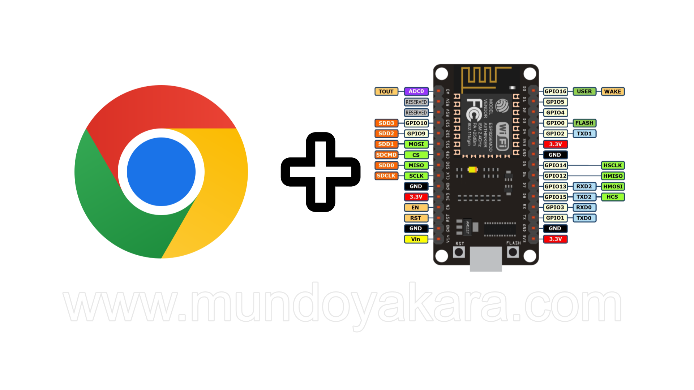

In order to use this web app, follow [this](arcade.md) tutorial.

#### 

El ESP32 es un dispositivo que nos facilita la implementacion de distintos tipos de proyectos y su programacion normalmente requiere de software y programas adicionales para grabar diferentes tipos de firmware para cada uno de los proyectos, y com tengo pensado implementar una gran saga de videos donde aprenderemos a crear distintos tipos de controles bluetooth para nuestro dispositivos **BLUERETRO** ademas de compatibilidad adicional para la **NINTENDO SWITCH** y siguiendo el trabajo de [witnessmenow](https://github.com/witnessmenow/ESP-Web-Tools-Tutorial) he creado esta pagina simple que se actualizara constantemente con el lanzamiento de cada proyecto asociado a [mi canal de youtube](https://www.youtube.com/channel/UCewluu5y7lA4QnXBJa_AbwQ)The first time you run it, you need to configure the WiFi, for that connect to the **"Clockwise-Wifi"** access point with the password _12345678_ via your smartphone or laptop, click "Configure WiFi" and select your AP, put in your password and your timezone and save. The timezone must be one of the listed [here](https://en.wikipedia.org/wiki/List_of_tz_database_time_zones) e.g. America/New_York, America/Sao_Paulo, Europe/Paris, Asia/Dubai, etc. so that the clock can connect to an NTP server to get the correct time. It is important to use a 2.4GHz WiFi, it will not work on 5G.

