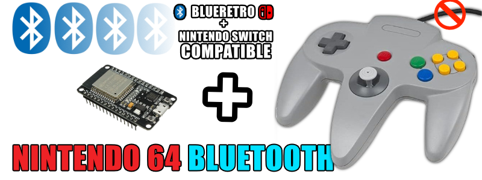
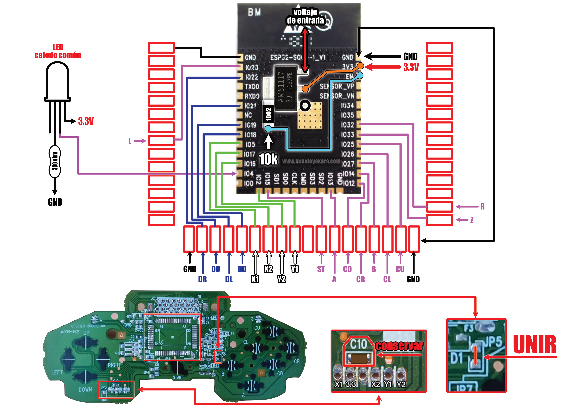

volver al [INICIO ](index.md).

#### un poco de historia?
Basado en una **Release no oficial** del [HOJA-LIB-ESP32](https://github.com/HandHeldLegend/HOJA-LIB-ESP32) proyecto original de [mitchellcairns](https://github.com/mitchellcairns) que nos permite utilizar nuestro **esp32 como un control de nintendo switch**, 

ademas de una nueva implementacion de doble fimrware gracias a **JPZV** por su [Blu N64](https://github.com/JPZV/BluN64-ESP32) 

Para cambiar entre payload de **BLUERETRO** y payload compatible con **NINTENDO SWITCH** Solo hay que mantener presionado **L + R + START** durante **10 segundos**

y esto nos permitira crear a futuro todo tipo de controles, convirtiendo directamente nuestros controles clasicos de cable en unos inalambricos bluetooth, asi que dejen volar su imaginacion mientras hacemos nuestro primer proyecto de doble payload

### totalmente compatible con 

-windows
-linux
-android
-tv box
-pandora
-blueretro
-steam deck
-nintendo switch normal
-nintendo switch lite
-nintendo switch oled

si queremos usar nuestro control bluetooth de n64 en una consola n64 con blueretro es totalmente **OBLIGATORIO** tener instalada la version **1.8.2 (o superior)** de blueretro [COMO LO VIMOS EN ESTE TUTORIAL](https://youtu.be/wpAVl-TC-Xg) de manera inalambrica sin conectar el esp32 a nuestro pc, o si podemos conectar podremos hacer una instalacion via usb [desde este enlace](blueretro.md)

### JPZV V1.1 para **"NINTENDO 64** 
Para grabar tu firmware **"UNIVERSAL N64 JPVZ"**, asegurate de conectar tu ESP32 via USB y presiona el siguiente boton. recuerda usar **CHROME** para ver este boton

<esp-web-install-button manifest="firmware/firmware_build/2-N64-UNIVERSAL-JPZV/manifest.json"></esp-web-install-button>

Para cambiar entre payload de **BLUERETRO** y payload compatible con **NINTENDO SWITCH** Solo hay que mantener presionado **L + R + START** durante **10 segundos**

#### tienes dudas de como HACER ESTE PROYECTO?

Este proyecto viene acompañado de un [video tutorial completo](https://youtu.be/PrA_Gp_z_Fw) no olvides verlo .

los diagramas en alta definicion puedes descargarlos [desde este enlace](https://blogger.googleusercontent.com/img/b/R29vZ2xl/AVvXsEjYVVNazktb112lT7u4XjNIBYx66Q7ZrU1JEnDORoSN_dr5oF6VwJjzFlBq_9--vRPlnLuCCC0ZeR-Q2l0XOHA-yxPT9OLS_jmQW66kpnmaIo6EsBVNxMCNrLW_vvZOxvqQmX4dy-1L9-oVNl9p_gK25WHH4c-sWkrviOV0bqO5rNVDqb-AGMWPLQM97w/s3508/n64%20universal.png)

