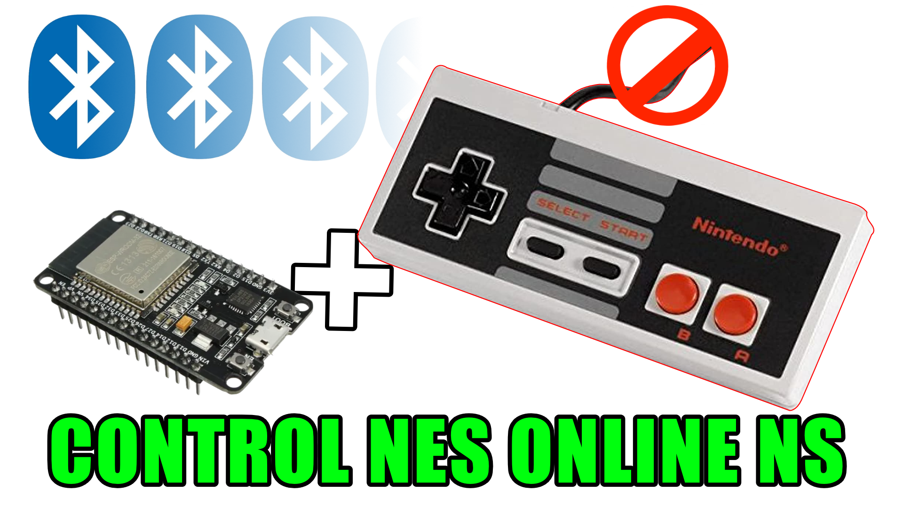
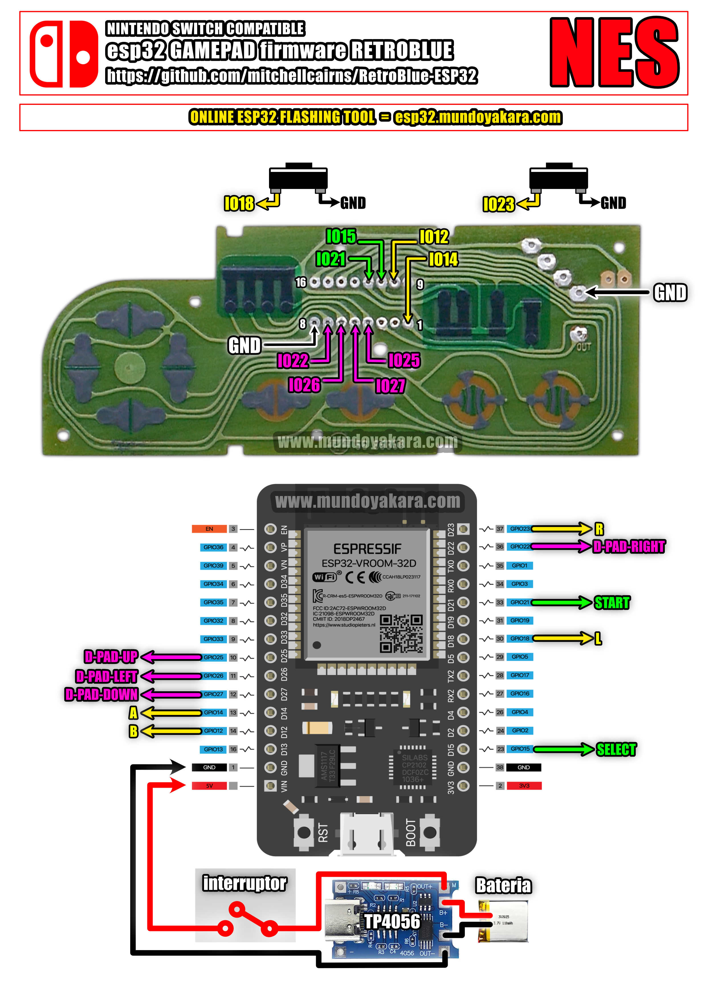
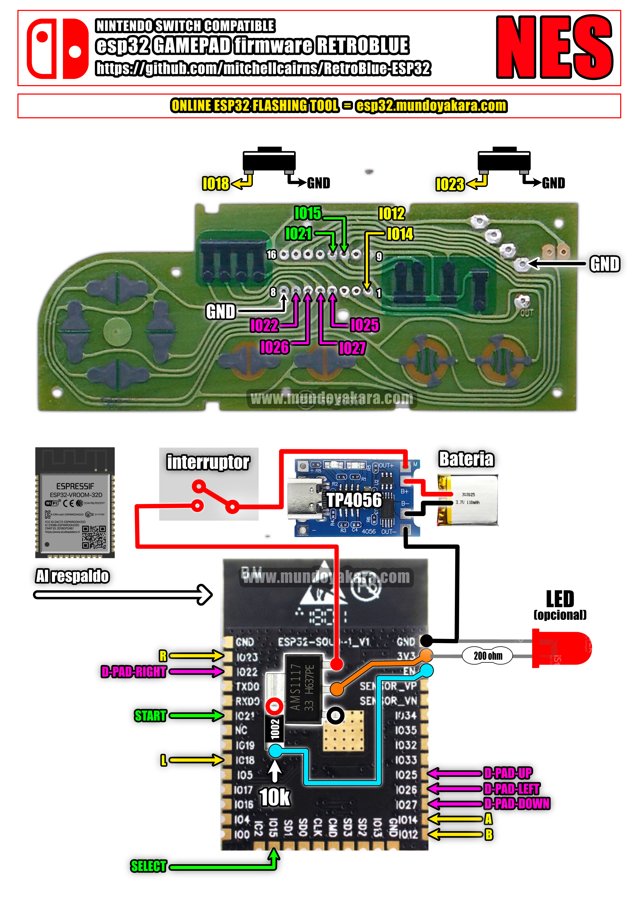

volver al [INICIO ](index.md).

### NES ONLINE esp32 DIY **UNIVERSAL** para **"NINTENDO SWITCH"** Y **BLUERETRO**

ademas de una nueva implementacion de doble fimrware gracias a **JPZV** en esta proyecto de ARCADE **usaremos una version modificada** del [Blu N64](https://github.com/JPZV/BluN64-ESP32) que ha evolucionado hasta convertirse muy pronto en la solucion definitiva para crear todo tipo de controles bluetooth, convirtiendo directamente nuestros controles clasicos de cable en unos inalambricos asi que dejen volar su imaginacion mientras hacemos un control tipo **NES**

Para cambiar entre payload de **BLUERETRO** y payload compatible con **NINTENDO SWITCH** Solo hay que mantener presionado **SELECT + START** durante **10 segundos**

y esto nos permitira crear todo tipo de controles y tambien hacer nuestra propias palancas tipo arcade
y lo mejor, 

### totalmente compatible con 

-windows
-linux
-android
-tv box
-pandora
-blueretro
-steam deck
-nintendo switch normal
-nintendo switch lite
-nintendo switch oled

Para grabar tu firmware para **"GAMEPAD TIPO genesis / megadrive  CON COMPATIBILIDAD CON NINTENDO SWITCH"**, Y **BLUERETRO** asegurate de conectar tu ESP32 via USB y presiona el siguiente boton. recuerda usar **CHROME** para ver este boton

<esp-web-install-button manifest="firmware/firmware_build/NES-UNIVERSAL-JPZV/manifest.json"></esp-web-install-button>

### DIAGRAMAS UNIVERSAL PARA EL CONTROL NES ONLINE esp32 DIY

### DIAGRAMAS UNIVERSAL PARA EL CONTROL NES ONLINE esp32 DIY lite version"

los diagramas en alta definicion puedes descargarlos [desde este enlace](https://www.mundoyakara.com/2022/07/como-hacer-control-nes-classic-edition.html)

