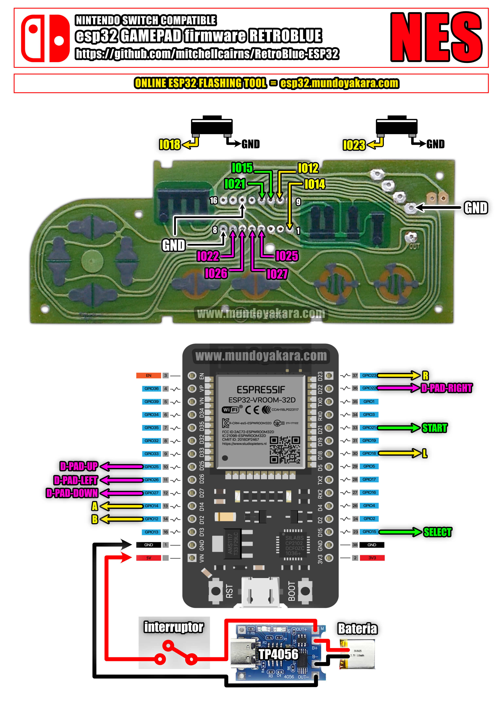

volver al [INICIO ](index.md).

### NES ONLINE esp32 DIY para **"NINTENDO SWITCH"** 

Para grabar tu firmware para **"GAMEPAD TIPO NES CON COMPATIBILIDAD CON NINTENDO SWITCH"**, asegurate de conectar tu ESP32 via USB y presiona el siguiente boton. recuerda usar **CHROME** para ver este boton

<esp-web-install-button manifest="firmware/firmware_build/nes-switch/manifest.json"></esp-web-install-button>

### informacion del firmware **"CONTROL NES ONLINE esp32 DIY"**
Basado en una **Release no oficial** modificada y remapeada en su totalidad por mi del [ESP-IDF RetroBlue Bluetooth Gamepad AP](https://github.com/mitchellcairns/RetroBlue-ESP32) proyecto original de [mitchellcairns](https://github.com/mitchellcairns) que nos permite utilizar nuestro **esp32 como un control de nintendo switch**, que no hace uso de NIMBLE y por ese motivo aun no es compatible con blueretro, pero si con **nintendo swicth normal, nintendo switch lite y nintendo switch oled**,
los botones y sus mapeos **son exactamente los mismos del diagrama**

#### tienes dudas de como HACER ESTE PROYECTO?

Este proyecto viene acompañado de un [video tutorial completo](https://youtu.be/o03lGDEhEgg) no olvides verlo .

### DIAGRAMAS UNIVERSAL PARA EL CONTROL NES ONLINE esp32 DIY

### DIAGRAMAS UNIVERSAL PARA EL CONTROL NES ONLINE esp32 DIY lite version"

los diagramas en alta definicion puedes descargarlos [desde este enlace](https://www.mundoyakara.com/2022/07/como-hacer-control-nes-classic-edition.html)

