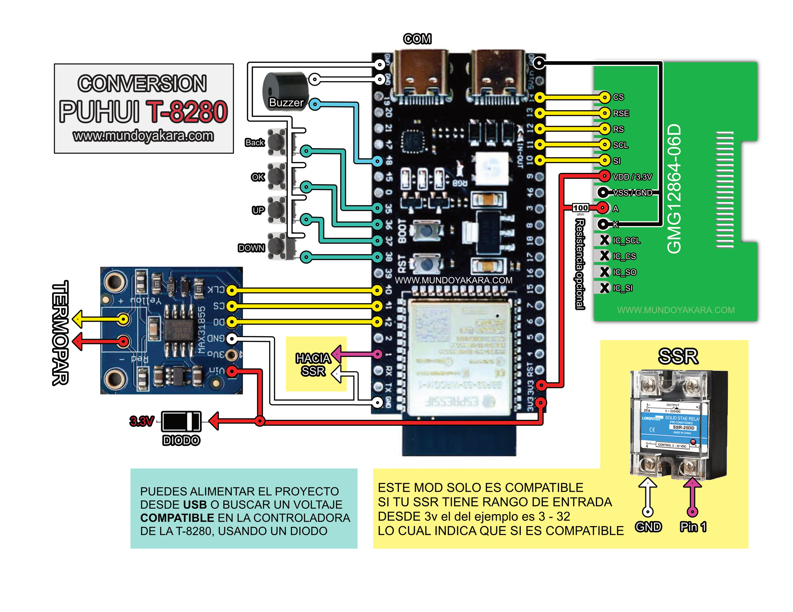

volver al [INICIO ](index.md).

###  **"firmware PRECALENTADOR"** MOD PUHUI T-8280

<esp-web-install-button manifest="firmware/firmware_build/PRECALENTADOR-ESP32/manifest.json"></esp-web-install-button>

#### no estan todas las consolas?
PUEDES VISITAR EL SIGUIENTE VIDEO:  para ver la instalacion, entender el funcionamiento y descargar el modelo 3d de este royecto

###  **"DIAGRAMA"** MOD PUHUI T-8280

