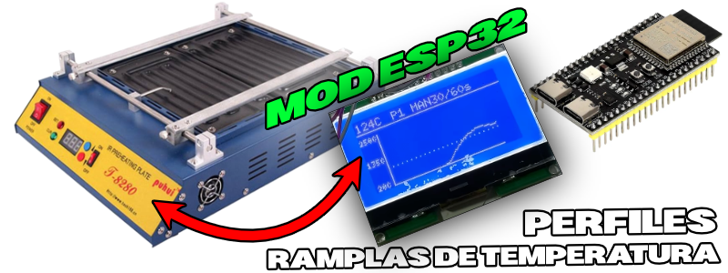
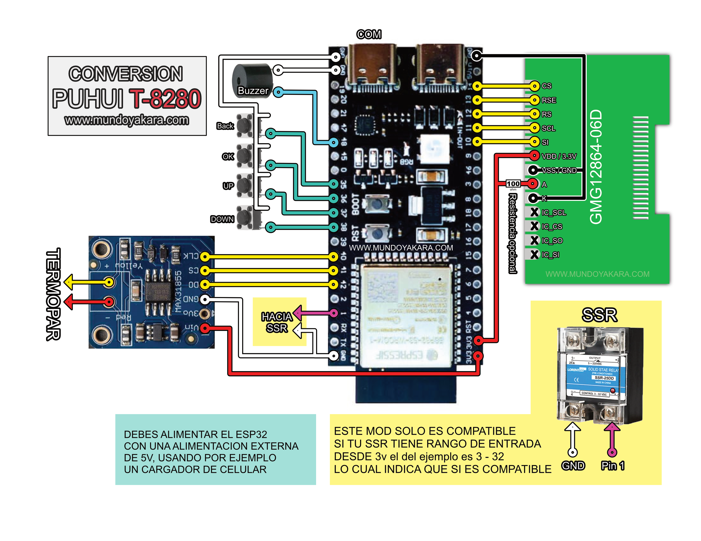

volver al [INICIO ](index.md).

###  **"firmware PRECALENTA-MOD"** MOD PUHUI T-8280

<esp-web-install-button manifest="firmware/firmware_build/PRECALENTA-MOD/manifest.json"></esp-web-install-button>

  
#### tienes dudas de como HACER ESTE PROYECTO?

Este proyecto viene acompañado de un [video tutorial completo](https://youtu.be/5mQKpUOdqcE) no olvides verlo .

###  **"DIAGRAMA"** MOD PUHUI T-8280

descarga los diagramas en alta definicion [desde este enlace](https://www.mundoyakara.com/2023/03/convierte-un-topper-en-una-palanca.html)

