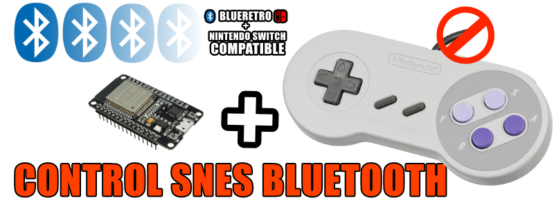
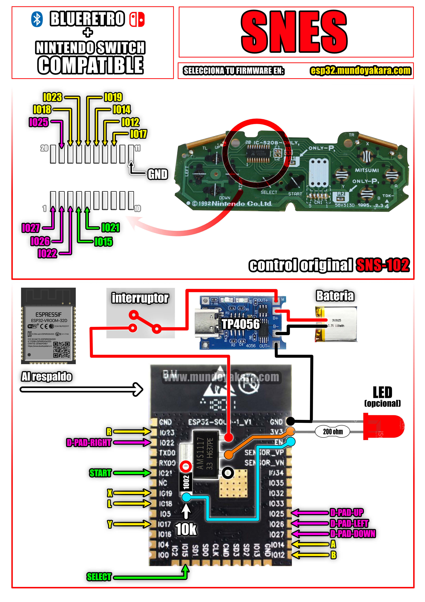

volver al [INICIO ](index.md).

### SNES UNIVERSAL JPZV FIRMWARE **"NINTENDO SWITCH + BLUERETRO"** 

Para grabar tu firmware para **"GAMEPAD TIPO SNES CON COMPATIBILIDAD CON NINTENDO SWITCH Y ADEMAS CON BLUERETRO"**, asegurate de conectar tu ESP32 via USB y presiona el siguiente boton. recuerda usar **CHROME** para ver este boton

<esp-web-install-button manifest="firmware/firmware_build/SNES-UNIVERSAL-JPZV/manifest.json"></esp-web-install-button>

### informacion del firmware **"CONTROL SNES ONLINE esp32 DIY"**

Basado en una **Release no oficial** del [HOJA-LIB-ESP32](https://github.com/HandHeldLegend/HOJA-LIB-ESP32) proyecto original de [mitchellcairns](https://github.com/mitchellcairns) que nos permite utilizar nuestro **esp32 como un control de nintendo switch**, ademas de una nueva implementacion de doble fimrware gracias a **JPZV** por su [ESP-IDF RetroBlue Bluetooth Gamepad AP](https://github.com/JPZV/Blue-N64-Control-ESP32) Para cambiar entre payload de **BLUERETRO** y payload compatible con **NINTENDO SWITCH** Solo hay que mantener presionado **START + SELECT** durante** 10 segundos**

### totalmente compatible con 

-windows
-linux
-android
-tv box
-pandora
-blueretro
-steam deck
-nintendo switch normal
-nintendo switch lite
-nintendo switch oled

#### tienes dudas de como HACER ESTE PROYECTO?

Este proyecto viene acompañado de un [video tutorial completo](https://youtu.be/o03lGDEhEgg) no olvides verlo .

### DIAGRAMAS UNIVERSAL PARA EL CONTROL NES ONLINE esp32 DIY lite version"

los diagramas en alta definicion puedes descargarlos [desde este enlace](https://www.mundoyakara.com/2022/07/como-hacer-control-nes-classic-edition.html)

